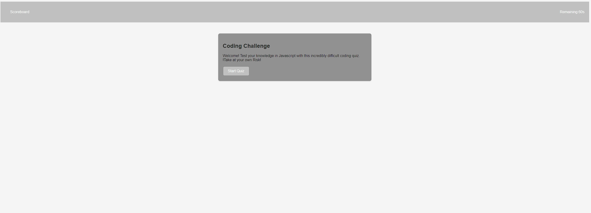

## Javascript Quiz Application
    Table of Contents
    Project Description

Features
Installation
Usage
Contribution
Support

This is a Javascript-based Quiz application developed as a part of a full-stack coding course. It serves as an interactive way to test knowledge about different aspects of Javascript, with the quiz containing questions about Javascript syntax, data types, and built-in methods.

## Features
A clean, user-friendly interface that guides users through a series of multiple-choice questions.
Users can track the time remaining for the quiz on a countdown timer.
The application maintains high scores that can be viewed on a separate screen.
Written in pure Javascript, HTML, and CSS, providing a good example of DOM manipulation and event handling.

## Installation
Clone the repository to your local machine.
Open the index.html file in your browser.

## Usage
Press the "Start Quiz" button to begin the quiz.
Select your answers for each question by clicking the corresponding button.
After answering all the questions or when the timer runs out, the final score is displayed.
You can then enter your initials to save the score, which can be viewed on the "High Scores" page.

Contribution
This project is open for contributions. Here are steps to contribute to this project:

Fork the repository.
Clone your forked repository.
Make your changes and commit them.
Push your changes to your forked repository.
Submit a pull request.
Before contributing, please ensure your code adheres to our styling conventions and is thoroughly tested!

## Screenshots

